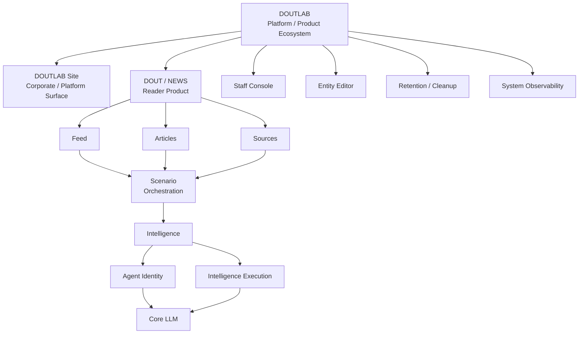

# DOUTLAB

> **Public architecture and product showcase for the DOUTLAB platform.**  
> The production source code is maintained separately in a private repository.

DOUTLAB is an evolving software platform and product ecosystem that grew out of an AI-assisted news aggregation project.

What started as a focused system for ingesting news sources, processing articles, and supporting editorial workflows gradually expanded into a broader architecture with reusable domain capabilities, AI-agent infrastructure, orchestration, internal tooling, and multiple product surfaces.

Today, **DOUT / NEWS is one product built on top of DOUTLAB — not the platform itself**.

This repository documents the public-facing architecture, system evolution, selected engineering decisions, product surfaces, diagrams, and screenshots without exposing the production codebase.

---

## From AI News Aggregator to Platform

The original product vision was centered on a personalized, AI-assisted news system:

- users should remain in control of the sources they trust;
- automation should be visible and explainable;
- AI should assist editorial work rather than replace product judgment;
- important processing steps should leave structured, reviewable records;
- personalization should evolve incrementally instead of becoming a black box;
- the system should be designed with future API and mobile clients in mind.

As the project grew, many components stopped being news-specific.

Source acquisition, content processing, feed policy, AI agents, execution history, publication logic, orchestration, staff tooling, and LLM infrastructure began to form independent, reusable capabilities.

The architectural evolution can be summarized as:

```text
AI News Aggregator
        ↓
structured ingestion / processing pipeline
        ↓
Feed + Articles + Sources
        ↓
Agent Identity + Intelligence Execution
        ↓
Scenario orchestration
        ↓
reusable platform capabilities
        ↓
DOUTLAB
        ↓
multiple products on a shared foundation
```

---

## System Overview



The important architectural idea is that products compose capabilities rather than owning all underlying business logic themselves.

---

## Products

### DOUT / NEWS

**DOUT / NEWS** is the public reader-facing news product.

Live product: **https://news.doutlab.com**

It composes reusable DOUTLAB capabilities into a complete user-facing experience and owns product-specific presentation and browser behavior, including:

- desktop and mobile presentation variants;
- reader-facing navigation and publication surfaces;
- continuous-feed and mobile reading behavior;
- selected reader presentation state;
- product-specific widgets and page composition;
- public editorial presentation.

NEWS does **not** own the internal semantics of ingestion, AI execution, publication, or orchestration. Those remain in their respective domains.

### DOUTLAB Site

The DOUTLAB corporate/platform site is a separate product surface.

Its purpose is to present DOUTLAB itself, introduce the platform and its systems, and provide the shared visual shell, layout, design tokens, theming, and selected presentation infrastructure consumed by other product surfaces.

It is intentionally separate from DOUT / NEWS.

---

## Core Domains

### Sources

`Sources` owns the acquisition and ingestion boundary.

Its responsibilities include:

- source identity and configuration;
- RSS/feed acquisition;
- source health tracking;
- automatic disable/recovery behavior;
- source analytics;
- ingestion provenance;
- durable ingestion batches.

Sources receives an already-resolved source scope. It does not decide editorial feed membership itself.

### Feed

`Feed` represents more than a rendered list of articles.

Its central concept is **FeedProfile** — a durable definition of an information space.

Feed owns:

- FeedProfile identity and versioning;
- source and topic membership;
- source-demand resolution;
- active feed selection;
- visibility/query boundaries;
- renderer-neutral ordering;
- cursor/window/chunk semantics;
- selected feed preference behavior.

Presentation layers consume these contracts instead of reimplementing feed visibility or ordering rules.

### Articles

The Articles domain separates the article lifecycle into distinct responsibilities.

#### Content Processing

Retrieves article pages and extracts readable content.

#### Application

Applies trusted Intelligence output to Articles while preserving provenance and controlled update semantics.

#### Publication

Owns publication lifecycle, reader-visible availability, and feed-position allocation.

This separation prevents acquisition, AI enrichment, and publication decisions from collapsing into one opaque pipeline.

---

## Intelligence

The AI architecture deliberately separates **who an Agent is** from **how an Agent performs a task**.

### Agent Identity

`Agent Identity` defines the stable composition of an Agent.

Identity can include:

- Background;
- Character;
- Analysis;
- Voice;
- Base Rules;
- Model Route;
- public editorial presentation metadata.

Agent Identity does not own task execution, runtime context, provider transport, or Scenario orchestration.

### Intelligence Execution

`Intelligence Execution` defines how an Agent executes an Action against explicit Context.

Core concepts include:

- `Action`;
- immutable `Snapshot`;
- immutable `Result`;
- structured output contracts;
- execution provenance;
- PromptBuilder;
- Prompt Manifest / Inspector / Diff / Export tooling;
- Intelligence Lab;
- Agent comparison tooling.

The goal is to make AI execution inspectable and reproducible enough to understand what context, configuration, and output were involved in a specific run.

---

## Core LLM

`Core LLM` is a provider-neutral platform layer for model execution.

It owns:

- Provider configuration;
- Model configuration;
- ModelRoute selection;
- credential indirection;
- provider adapters;
- the normalized `LLMGateway` boundary;
- request/response normalization;
- usage records;
- pricing and cost accounting.

Business domains and Agent Identity should not depend on the implementation details of a specific LLM provider.

This allows provider and model routing to evolve without redefining what an Agent, Action, or product workflow means.

---

## Scenario

`Scenario` is the orchestration and composition layer.

It connects:

- trigger intent;
- registered domain capabilities;
- validated configuration;
- artifact handoff;
- execution ordering;
- execution history;
- execution snapshots.

A key boundary is that Scenario should not reproduce the internal logic of Sources, Articles, Feed, or Intelligence.

Instead, it invokes registered capabilities through explicit input/output artifact contracts.

This makes workflows more repeatable, auditable, and composable than a hard-coded chain of internal calls.

---

## Reusable Platform Capabilities

### Staff Console

Shared internal infrastructure for staff/admin product surfaces, including:

- navigation registry;
- staff access boundary;
- presentation-package architecture;
- Control Center composition.

### Entity Editor

Reusable editing infrastructure for explicitly registered entities.

It provides shared editor lifecycle and presentation mechanics while leaving domain-specific business semantics, persistence rules, and validation ownership to the corresponding domain.

### Retention / Cleanup

Reusable execution infrastructure for cleanup handlers:

- cutoff calculation;
- batch execution;
- dry-run behavior;
- structured reports;
- scheduling integration.

The cleanup runner executes policy. Resource owners define what is safe and eligible to remove.

### System Observability

A focused internal capability for structured runtime diagnostics and historical inspection.

It is intentionally narrower than a general-purpose observability platform.

---

## Architectural Principle: Ownership Before Convenience

As DOUTLAB has grown, its architecture has increasingly favored explicit responsibility boundaries.

Examples:

- Feed decides what belongs to an information space; Sources performs acquisition.
- Sources fetches data; it does not define editorial feed policy.
- Publication decides when an Article becomes published; Feed consumes that fact.
- Scenario orchestrates capabilities; it does not own their internal implementation.
- Intelligence defines Agent and execution semantics; Core LLM owns provider transport.
- Staff Console composes domain-owned information; it does not absorb domain business logic.

This approach is intended to keep the platform extensible as new products and capabilities are added.

---

## AI as an Engineering Component, Not a Black Box

One of the original product principles remains important across the platform:

**AI output should be observable, reviewable, and attributable.**

That is why the system places emphasis on:

- structured outputs;
- immutable execution snapshots and results;
- provenance;
- prompt inspection;
- explicit provider/model routing;
- usage accounting;
- explicit orchestration;
- reviewable publication flows.

AI-generated titles, summaries, bodies, tags, classifications, or scores are treated as system outputs with context and provenance — not as unquestionable final truth simply because a model generated them.

---

## Engineering Approach

DOUTLAB is being developed as a platform rather than as a sequence of isolated feature patches.

Current engineering principles include:

- Git documentation is the canonical source of truth;
- external documentation mirrors are for access and collaboration, not canonical ownership;
- runtime controls should remain operator-adjustable where practical;
- operational state should be structured rather than inferred from text logs;
- models and workflows should remain compatible with future API/mobile consumers;
- completed capabilities should be covered by tests;
- architecture and contracts should document ownership boundaries explicitly;
- changes should remain scoped and avoid unnecessary rewrites.

---

## Current Architecture vs. Roadmap

This repository distinguishes implemented architecture from future direction.

### Present in the current architecture

- Sources ingestion and health;
- FeedProfile and renderer-neutral feed contracts;
- Articles processing / application / publication boundaries;
- Agent Identity;
- Intelligence Execution;
- provider-neutral Core LLM;
- Scenario orchestration;
- DOUT / NEWS;
- DOUTLAB corporate/platform surface;
- Staff Console;
- Entity Editor;
- Retention / Cleanup infrastructure.

### Direction of further development

Some ideas are already represented in design documents and roadmaps but should not be interpreted as fully implemented platform capabilities yet:

- Agent Memory;
- deeper personalization;
- a broader mobile API;
- user-owned and specialized Agents;
- broader entitlement/subscription capabilities;
- additional products built on the shared platform.

This list will evolve with the platform.

---

## Why the Production Source Code Is Private

The main DOUTLAB production repository is intentionally private.

This public repository exists to show:

- system architecture;
- product structure;
- platform evolution;
- selected engineering decisions;
- diagrams;
- screenshots;
- public products;
- development direction.

Over time, this repository will contain additional sanitized architecture material and product documentation without exposing credentials, production internals, or implementation details that should remain private.

---

## Repository Structure

Planned public documentation structure:

```text
README.md
docs/
├── architecture.md
├── evolution.md
├── ai-development-workflow.md
├── products/
│   └── news.md
├── diagrams/
└── screenshots/
```

---

## In Short

DOUTLAB started as an AI News Aggregator.

It has evolved into a broader platform where products are built on top of reusable domain and platform capabilities, with explicit boundaries between ingestion, feed policy, article lifecycle, AI identity, AI execution, orchestration, and presentation.

The long-term goal is not simply to add AI to an application, but to build a system in which **AI, automation, and product logic remain observable, controllable, and independently evolvable**.
