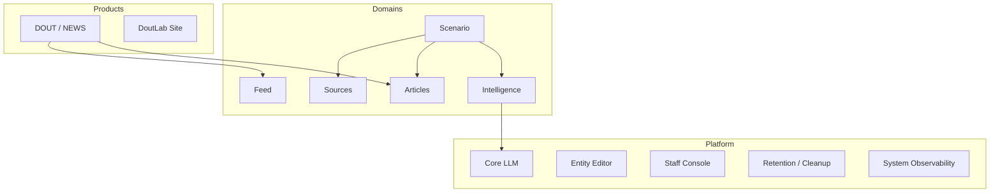

# Architecture

This document explains DoutLab's architecture conceptually: how responsibility is divided, which
direction dependencies are allowed to run, and why those boundaries exist. It intentionally avoids
file paths, function names, database schema, and route-level detail — those belong to the internal
engineering documentation this overview is derived from, not to a public architectural read.

## Three ownership tiers

DoutLab is organized into three tiers with one normative dependency direction:

```text
            ┌───────────────────────────────────────────────┐
            │  PRODUCTS                                      │
            │  concrete, user-facing systems and composition │
            │  (DOUT / NEWS, the DoutLab corporate site)     │
            └───────────────────────────────────────────────┘
                              │ composes
                              ▼
            ┌───────────────────────────────────────────────┐
            │  DOMAINS                                       │
            │  reusable business capability and policy       │
            │  (Sources, Feed, Articles, Intelligence,        │
            │   Scenario)                                    │
            └───────────────────────────────────────────────┘
                              │ consumes
                              ▼
            ┌───────────────────────────────────────────────┐
            │  PLATFORM                                      │
            │  reusable technical infrastructure              │
            │  (Core LLM, Entity Editor, Staff Console,       │
            │   Retention / Cleanup, System Observability)    │
            └───────────────────────────────────────────────┘
```

**Products** own everything about how a concrete surface looks, navigates, and behaves for its
audience. **Domains** own a piece of business capability and policy that is meaningful independent of
any one product — the same Feed or Scenario concept is not re-invented per product. **Platform** owns
technical infrastructure that is useful to many domains and products but is not itself a business
concern — calling a language model is a platform problem; deciding what an AI agent should say is not.

The dependency direction only runs downward: a product may consume a domain's and platform's
capabilities; a domain must never depend on a specific product's presentation; platform infrastructure
must never depend on business policy belonging to a domain. This keeps each tier replaceable and
testable on its own terms — a new product can be built on the existing domains without touching them,
and a domain can evolve its internals without a product noticing, as long as the capability it exposes
stays stable.

A few concrete examples of the same principle: Sources owns source configuration and acquisition, while
Feed consumes already-acquired content rather than owning acquisition logic itself. Publication-facing
concerns consume Feed's and Articles' resolved state rather than that business logic moving into
presentation code. Scenario orchestrates domain capabilities without taking ownership of any of those
domains. Intelligence owns AI execution semantics while Core LLM owns the lower-level model/provider
infrastructure underneath it. Staff Console exposes operational and domain controls to internal
operators without becoming the owner of the underlying domain logic it surfaces.

## System overview

The same three tiers, with their current concrete members and the dependencies that actually exist
today:



This intentionally omits a few relationships that exist only as future direction today — for example,
Scenario does not yet orchestrate Feed directly, and DoutLab Site has no normative dependency on the
domain/platform stack at all (it owns the shared visual shell other products extend, not a consumer
relationship with these domains). Platform modules are drawn without incoming arrows here because they
are cross-cutting infrastructure several domains' own internal tooling draws on, not a single clean
caller.

## How products are composed

A product does not implement its own version of source acquisition, feed composition, or AI execution.
It composes the domains above into one coherent reader- or operator-facing experience and owns the
presentation-layer decisions that are genuinely specific to it: navigation, page composition, visual
design, and product-specific behavior that has no meaning outside that one surface.

**DOUT / NEWS**, the public news-reading product, is the clearest example: it consumes an already-resolved feed, an already-published article, and an already-produced AI briefing, and owns how those
are presented, paginated, and navigated in the browser. It does not decide which sources are in scope,
when an article becomes visible, or when an AI task runs — those are domain decisions it consumes, not
reproduces.

The DoutLab corporate site is a second, independent product sharing the same underlying platform
conventions and a shared visual shell, introducing DoutLab as a company rather than acting as a reading
surface itself.

## Orchestration as its own boundary: Scenario

A system that acquires content, enriches it with AI, and publishes it needs *something* to decide when
each step runs and in what order — but that "something" should not need to understand how acquisition,
enrichment, or publication actually work internally. That is the problem Scenario solves.

Scenario connects three things into one repeatable, auditable run: a **trigger** (why this run is
happening), an ordered sequence of **registered capabilities** drawn from the domains, and a durable
**execution history** recording exactly what happened. Each capability it invokes is an opaque,
versioned call with one input and one output — Scenario does not reach into a domain's internals, loop
over its data, or make business decisions on its behalf. This is a deliberate constraint, not a
limitation: Scenario is an orchestration layer, not a general-purpose workflow engine, and keeping it
narrow is what lets each domain evolve independently without becoming entangled with how and when it
gets called.

Today, a Scenario actually runs **manually** or **on a schedule** — those are the trigger kinds that
currently execute in production. The trigger model is also designed to support running **in response to
an event** (e.g. something else in the system happening), and the registration/authoring foundations
for that already exist, but no production event-triggered execution runs today. This is future
direction, not current behavior.

## AI identity, AI execution, and LLM infrastructure: three separate concerns

A recurring architectural distinction worth naming on its own, because conflating it is a common and
costly mistake: **who an AI agent is**, **how it executes a task**, and **the raw infrastructure that
calls a language model** are three independent layers, not one.

- **Agent Identity** defines what makes an agent itself — its background, character, analytical
  stance, and voice, and the fixed order in which those compose into one coherent identity. This layer
  answers "who is speaking," and it does not know what task it is about to perform.
- **Intelligence Execution** defines how an agent performs one concrete task: the action it is asked
  to do, the exact context it is given, and the structured, auditable result it produces. This layer
  answers "what was asked and what came back," and it does not define who the agent is.
- **Core LLM** is the technical infrastructure underneath both: provider and model configuration,
  credential handling, request/response normalization across providers, and usage/cost accounting. This
  layer answers "which provider actually ran this call and what did it cost," and it has no concept of
  agents, actions, or identity at all.

Separating these means a new AI provider can be integrated without touching what any agent is or how it
behaves; an agent's identity can be refined without touching execution mechanics; and a new kind of task
can be introduced without either layer below it needing to change. As the platform adds more agents,
more tasks, and more providers, this separation is what keeps that growth additive instead of
multiplicative.

## AI as an engineering component, not a black box

A recurring design intent across the architecture above: an AI execution should be something the
system can inspect and account for, not an opaque step whose output is simply trusted. Concretely, this
shows up as a handful of current properties rather than an abstract promise:

- the exact context an execution ran against is fixed and preserved (an immutable Snapshot), not
  reconstructed after the fact;
- the output of an execution is itself immutable and structured against a defined output contract,
  rather than free-form text parsed by convention;
- the prompt and configuration an execution actually used can be inspected after the fact, not only
  assumed from current configuration;
- which provider and model handled a given call, and what it cost, is recorded per call, not estimated;
- the editorial decision that makes AI-touched content visible to readers is a distinct, reviewable step
  — producing output and publishing it are never the same action.

None of this makes AI output authoritative by default. It makes it possible to ask, for any given
result, what produced it and under what conditions — which is the property that matters as more of the
system comes to depend on AI-produced output.

## Reusable platform capabilities

Infrastructure that more than one part of the system needs is extracted into its own platform module
rather than duplicated or coupled to whichever domain happened to need it first:

- **Core LLM**, described above, is consumed by Intelligence today — the one domain that actually
  calls a language model — rather than being a dependency every domain holds directly.
- **Entity Editor** is a reusable staff-facing editing framework: a consistent way to create, inspect,
  and modify a registered kind of record, used across multiple domains' internal tooling rather than
  each domain inventing its own editing UI.
- **Staff Console** is the shared internal operator shell and presentation conventions that domain- and
  product-specific internal tooling is built inside of.
- **Retention / Cleanup** is reusable execution/scheduling infrastructure for deleting data that is no
  longer needed. It owns running cleanup safely and on schedule; it deliberately does not own which
  records are eligible or for how long — that policy stays with each resource's owning domain.
- **System Observability** is a narrow, current diagnostic capability: staff-facing system-status
  aggregation and historical run inspection. It is not a general-purpose observability or analytics
  platform, and is not described here as more than it currently is.

None of these platform modules encode business policy. They exist precisely so that business policy —
what Sources are allowed, what a Scenario is allowed to do, what an Agent's identity contains — stays
entirely inside the owning domain, never inside the infrastructure the domain happens to run on.

## Why these boundaries matter as the platform grows

The practical payoff of this structure is substitutability without a rewrite. A new product can be
built on the existing domains without re-implementing source acquisition or AI execution. A new AI
provider can be added without redesigning what an agent is. A new kind of automated workflow can be
composed from existing, already-trusted domain capabilities without Scenario needing to understand any
of their internals. The alternative — one monolithic pipeline where acquisition, AI processing, and
publication are directly coupled — is exactly the shape DoutLab moved away from; see
[evolution.md](evolution.md) for why that coupling became a real constraint and how the current
boundaries emerged from it.

## Runtime foundation

DoutLab runs as a server-side application with asynchronous background task execution for work that
should not block a request — ingestion, AI execution, and orchestration all run this way. This is
stated here only as grounding for a technically literate reader; the underlying frameworks, deployment
topology, and operational configuration are intentionally not part of this public document.
